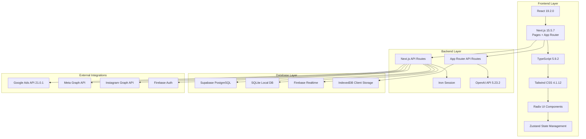
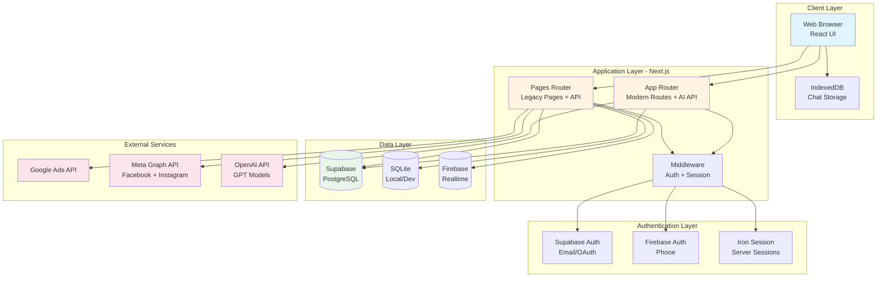
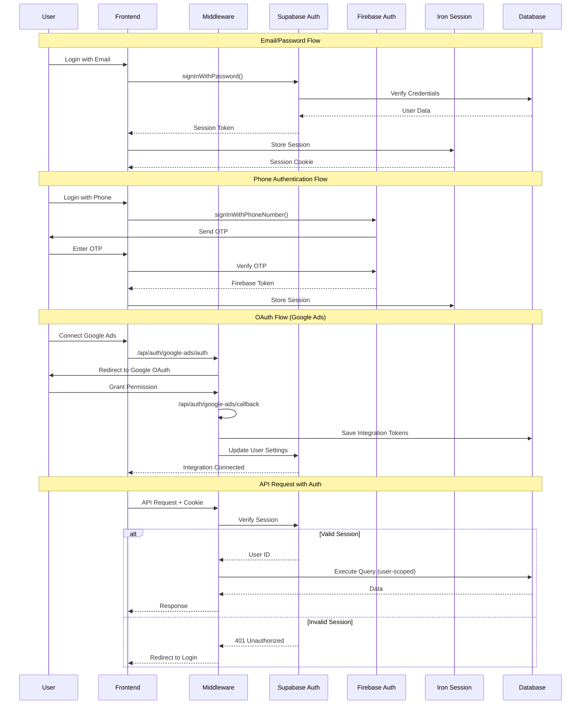
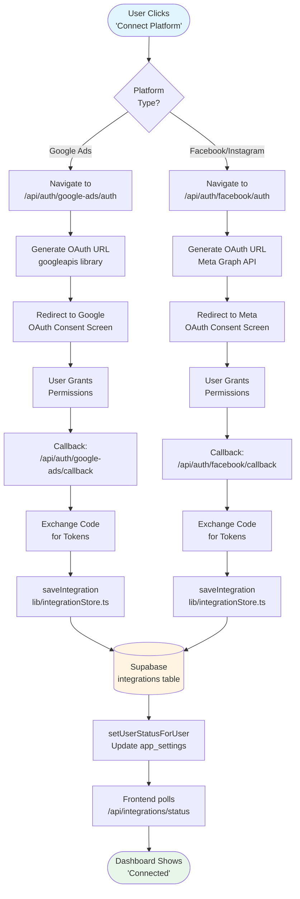
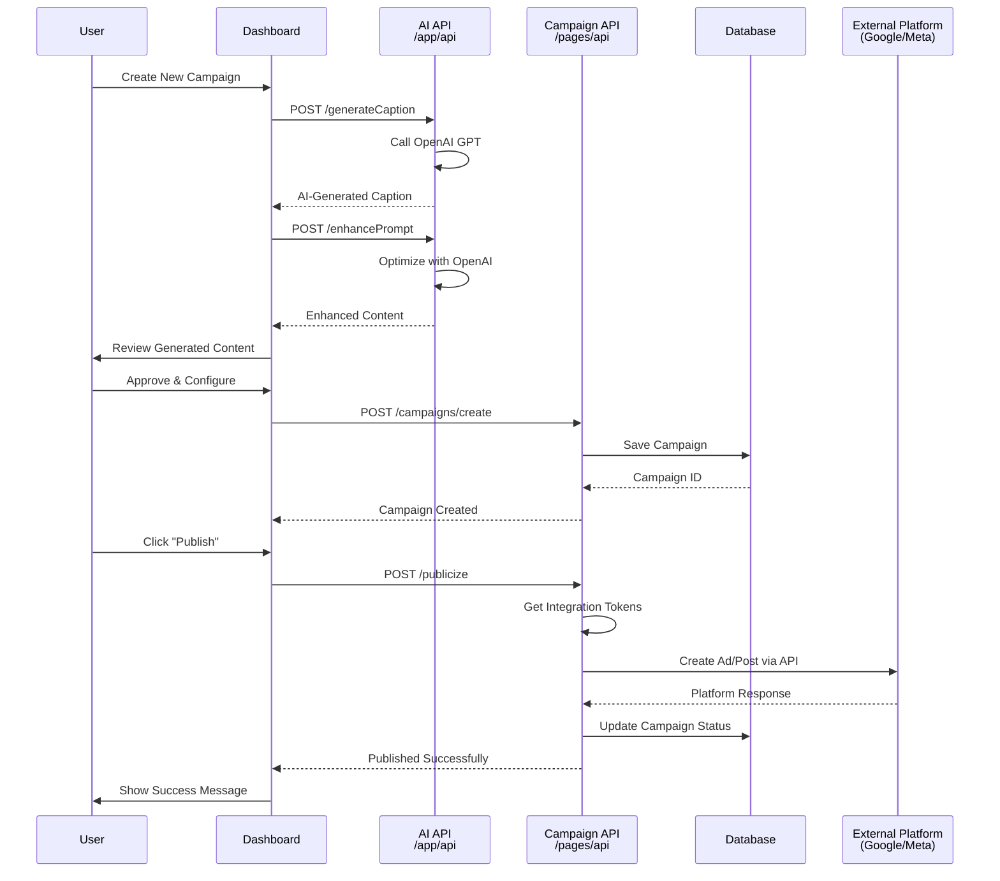

# OptimX - AI-Powered Marketing Automation Platform

**Version:** 0.2.0 (Beta)

## Overview

OptimX is a comprehensive social media marketing automation platform that leverages AI to streamline campaign creation, management, and optimization across multiple advertising platforms. Built with modern web technologies, OptimX provides a unified interface for managing Google Ads, Meta (Facebook/Instagram), and other major advertising platforms.

### Key Features

- **Multi-Platform Integration**: Connect and manage Google Ads, Facebook, Instagram, LinkedIn, and Twitter from a single dashboard
- **AI-Powered Content Generation**: Automated caption writing, campaign creation, and prompt enhancement using OpenAI
- **Real-Time Analytics**: Comprehensive insights and metrics aggregation across all connected platforms
- **Campaign Automation**: Streamlined workflow from content creation to publishing
- **Credit-Based System**: Flexible usage-based billing model
- **Responsive Dashboard**: Modern, intuitive interface built with React and Tailwind CSS

### Target Users

- Digital marketing agencies managing multiple client accounts
- Social media managers coordinating cross-platform campaigns
- Small business owners automating their marketing workflows
- Marketing teams seeking AI-powered optimization

---

## Tech Stack Overview



### Technology Stack

| Category | Technology | Version | Purpose |
|----------|-----------|---------|---------|
| **Framework** | Next.js | 15.5.7 | Full-stack React framework with SSR/SSG |
| **UI Library** | React | 19.2.0 | Component-based UI development |
| **Language** | TypeScript | 5.9.2 | Type-safe development |
| **Styling** | Tailwind CSS | 4.1.12 | Utility-first CSS framework |
| **Components** | Radix UI | 1.x | Accessible headless component library (50+ components) |
| **State** | Zustand | 5.0.8 | Lightweight state management |
| **Forms** | React Hook Form | 7.66.0 | Performant form validation |
| **Charts** | Recharts | 3.3.0 | Data visualization |
| **Database** | Supabase | 2.58.0 | PostgreSQL with real-time capabilities |
| **Auth** | Supabase + Firebase | - | Multi-provider authentication |
| **AI** | OpenAI API | 5.23.2 | Content generation and enhancement |
| **Ads** | Google Ads API | 21.0.1 | Google advertising platform integration |
| **HTTP** | Axios | 1.12.2 | API request handling |

---

## System Architecture

### High-Level Architecture



**Architecture Overview:**

OptimX uses a **hybrid Next.js architecture** combining both the Pages Router (legacy, mature) and App Router (modern, cutting-edge):

- **Pages Router** (`/pages`): Handles all user-facing pages and the majority of API endpoints (46 routes)
- **App Router** (`/app`): Powers AI-driven endpoints and modern component architecture

This dual-router approach enables gradual migration while maintaining stability and leveraging new Next.js 13+ features for AI operations.

### Detailed Component Architecture

```mermaid
graph LR
    subgraph "Frontend Components"
        DASH[Dashboard<br/>pages/dashboard.tsx]
        INT[Integrations<br/>pages/integrations*.tsx]
        LIB[Library<br/>pages/library.tsx]
        ANAL[Analytics<br/>pages/analytics.tsx]
        HERO[Landing Pages<br/>app/web/src/components/]
    end

    subgraph "Core Libraries /lib"
        ISTORE[integrationStore.ts<br/>Platform Connections]
        SUPA[supabaseClient.ts<br/>Database Client]
        FIRE[firebaseClient.ts<br/>Phone Auth]
        API[apiFetch.ts<br/>HTTP + Auth]
        CHAT[chatDB.ts<br/>IndexedDB Client]
    end

    subgraph "API Routes /pages/api"
        AUTH[/auth/*<br/>OAuth Flows]
        CAMP[/campaigns/*<br/>Campaign Mgmt]
        INTAPI[/integrations/*<br/>Platform Status]
        CRED[/credits/*<br/>Billing]
    end

    subgraph "AI Routes /app/api"
        ENH[/enhancePrompt<br/>Prompt Enhancement]
        CAP[/generateCaption<br/>Caption Generation]
        GCAMP[/generate-campaign<br/>Campaign Generation]
    end

    DASH --> API
    INT --> API
    LIB --> API
    ANAL --> API

    API --> AUTH
    API --> CAMP
    API --> INTAPI
    API --> CRED
    API --> ENH
    API --> CAP
    API --> GCAMP

    AUTH --> ISTORE
    CAMP --> SUPA
    INTAPI --> ISTORE
    INTAPI --> SUPA

    ISTORE --> SUPA
    CHAT --> IDB[(IndexedDB)]
```

**Component Interaction:**

1. **Frontend Components** interact with backend through `apiFetch()` utility
2. **Core Libraries** provide reusable business logic and database clients
3. **API Routes** handle platform integrations, data operations, and user management
4. **AI Routes** leverage OpenAI for content generation and optimization

---

## Authentication & Authorization Flow



### Authentication Methods

1. **Email/Password**: Supabase Auth with secure password hashing
2. **Phone Number**: Firebase Authentication with SMS OTP
3. **OAuth 2.0**: Google, Facebook, Instagram platform connections
4. **Session Management**: Iron Session for server-side session persistence

### Token Management

**Multi-tier token storage system:**

- **Access Tokens**: Short-lived platform API tokens (Google Ads, Meta)
- **Refresh Tokens**: Long-lived tokens for automatic renewal
- **Page Tokens**: Meta-specific page access tokens
- **User Tokens**: Meta-specific user access tokens

All tokens are stored in Supabase `integrations` table with per-user isolation.

### Security Features

- **User Isolation**: All queries filter by authenticated `user_id`
- **Token Encryption**: Sensitive tokens encrypted at rest in Supabase
- **HTTPS-Only**: All production traffic over secure connections
- **Environment Secrets**: API keys stored in environment variables
- **Session Expiry**: Automatic session timeout and renewal

---

## Data Flow & Integration Pipeline

### Integration Connection Flow



### Campaign Creation & Publishing Flow



### Data Synchronization

**Client-Side (IndexedDB):**
- Chat messages stored locally in `optim-app-db`
- Sync queue for offline operations
- Automatic background sync when online

**Server-Side (Supabase):**
- Real-time subscriptions for live updates
- Per-user data isolation with Row Level Security (RLS)
- Automatic backup and replication

---

## Project Structure

```
OptimX---Beta/
│
├── app/                                    # Next.js App Router (Modern)
│   ├── api/                               # AI-powered API routes
│   │   ├── enhancePrompt/route.ts        # OpenAI prompt enhancement
│   │   ├── generateCaption/route.ts      # AI caption generation
│   │   ├── generate-campaign/route.ts    # Campaign generation
│   │   └── translate-prompt/route.ts     # Multi-language translation
│   ├── layout.tsx                         # Root application layout
│   ├── not-found.tsx                      # 404 error page
│   └── web/src/                           # Web application components
│       ├── components/                    # 16+ custom components
│       │   ├── Hero.tsx                   # Landing page hero
│       │   ├── Header.tsx                 # Navigation header
│       │   ├── Sidebar.tsx                # Dashboard sidebar
│       │   ├── Features.tsx               # Feature showcase
│       │   ├── ui/                        # 50+ Radix UI components
│       │   │   ├── button.tsx
│       │   │   ├── dialog.tsx
│       │   │   ├── form.tsx
│       │   │   └── ...
│       └── hooks/                         # Custom React hooks
│           ├── use-credits.ts             # Credit management
│           ├── use-toast.ts               # Toast notifications
│           └── use-mobile.tsx             # Responsive detection
│
├── pages/                                  # Next.js Pages Router (Legacy + Active)
│   ├── api/                               # Backend API routes (46 endpoints)
│   │   ├── auth/                          # Authentication & OAuth
│   │   │   ├── google-ads/                # Google Ads integration
│   │   │   │   ├── auth.ts                # OAuth initiation
│   │   │   │   ├── callback.ts            # OAuth callback handler
│   │   │   │   ├── profile.ts             # User profile retrieval
│   │   │   │   ├── clientAccounts.ts      # List ad accounts
│   │   │   │   └── runCampaign.ts         # Execute campaigns
│   │   │   ├── facebook/                  # Facebook/Meta integration
│   │   │   │   ├── getPosts.ts            # Fetch posts
│   │   │   │   ├── getCampaigns.ts        # Fetch campaigns
│   │   │   │   ├── getAdInsights.ts       # Analytics data
│   │   │   │   ├── ads.ts                 # Ad creation/management
│   │   │   │   └── summaryMetrics.ts      # Aggregated metrics
│   │   │   └── instagram/                 # Instagram integration
│   │   │       ├── getMedia.ts            # Fetch media
│   │   │       ├── post.ts                # Create posts
│   │   │       └── callback.ts            # OAuth callback
│   │   ├── integrations/                  # Integration management
│   │   │   ├── status.ts                  # Check connection status
│   │   │   ├── get.ts                     # Fetch integration details
│   │   │   ├── disconnect.ts              # Remove connection
│   │   │   └── metrics.ts                 # Integration analytics
│   │   ├── campaigns/                     # Campaign operations
│   │   ├── chats/                         # Chat management
│   │   ├── credits/                       # Billing & credits
│   │   ├── publicize/                     # Content publishing
│   │   └── recommendations/               # AI recommendations
│   ├── dashboard.tsx                      # Main application dashboard
│   ├── analytics.tsx                      # Analytics & insights page
│   ├── integrations.tsx                   # Platform connections page
│   ├── library.tsx                        # Content library
│   ├── settings.tsx                       # User settings
│   ├── auth/                              # Authentication pages
│   │   ├── signin.tsx                     # Sign in page
│   │   ├── signup.tsx                     # Registration page
│   │   └── forgot-password.tsx            # Password recovery
│   ├── index.tsx                          # Landing page
│   └── [20+ other pages]                  # Additional pages
│
├── lib/                                    # Core business logic (14 modules)
│   ├── integrationStore.ts                # Platform integration management
│   │                                      # - saveIntegration()
│   │                                      # - getIntegration()
│   │                                      # - setUserStatusForUser()
│   │                                      # - getUserStatuses()
│   ├── supabaseClient.ts                  # Supabase client initialization
│   ├── supabaseAdmin.ts                   # Supabase admin operations
│   ├── firebaseClient.ts                  # Firebase client setup
│   ├── firebaseAdmin.ts                   # Firebase admin SDK
│   ├── apiFetch.ts                        # Authenticated HTTP client
│   │                                      # - Automatic token injection
│   │                                      # - Session management
│   │                                      # - Multi-source auth resolution
│   ├── chatDB.ts                          # IndexedDB client storage
│   ├── googleAdsTokens.ts                 # Google Ads token management
│   ├── authHelpers.ts                     # Auth utility functions
│   └── utils.ts                           # General utilities
│
├── data/                                   # Local databases & configuration
│   ├── db.sqlite                          # Main SQLite database
│   ├── db.sqlite-wal                      # Write-ahead log
│   ├── ads_tokens.db                      # Google Ads tokens
│   ├── integrations.json                  # Integration config
│   └── instagram.json                     # Instagram data
│
├── hooks/                                  # Custom React hooks
│   └── useChats.tsx                       # Chat state management
│
├── utils/                                  # Utility functions
│   └── updateCredits.ts                   # Credit system utilities
│
├── styles/                                 # Global styles
│   └── globals.css                        # Tailwind base styles
│
├── public/                                 # Static assets
│   └── images/                            # Image files
│
├── legacy/                                 # Archived components
│   ├── blog.tsx
│   ├── newdashboard.tsx
│   └── [archived files]
│
├── Configuration Files
│   ├── package.json                       # Dependencies & scripts
│   ├── tsconfig.json                      # TypeScript configuration
│   ├── next.config.ts                     # Next.js configuration
│   ├── tailwind.config.js                 # Tailwind CSS settings
│   └── postcss.config.js                  # PostCSS configuration
│
└── .vercel/                               # Vercel deployment config
```

---

## API Reference

### Authentication Endpoints

#### Google Ads Integration
- `GET /api/auth/google-ads/auth` - Initiate OAuth flow
- `GET /api/auth/google-ads/callback` - Handle OAuth callback
- `GET /api/auth/google-ads/profile` - Fetch user profile
- `GET /api/auth/google-ads/clientAccounts` - List available ad accounts
- `POST /api/auth/google-ads/runCampaign` - Execute advertising campaign

#### Facebook/Instagram Integration
- `GET /api/auth/facebook/getPosts` - Retrieve Facebook posts
- `GET /api/auth/facebook/getPostComments` - Fetch post comments
- `GET /api/auth/facebook/getCampaigns` - List ad campaigns
- `GET /api/auth/facebook/getAds` - Retrieve ads
- `GET /api/auth/facebook/getAdInsights` - Get analytics data
- `POST /api/auth/facebook/ads` - Create/manage ads
- `POST /api/auth/facebook/comment` - Post comments
- `GET /api/auth/facebook/summaryMetrics` - Aggregated metrics

#### Instagram Specific
- `GET /api/auth/instagram/getMedia` - Fetch media items
- `GET /api/auth/instagram/getPosts` - Retrieve posts
- `POST /api/auth/instagram/post` - Create new post
- `DELETE /api/auth/instagram/deleteMedia` - Remove media
- `GET /api/auth/instagram/callback` - OAuth callback handler

### Integration Management

- `GET /api/integrations/status` - Get connected platforms (user-scoped)
- `GET /api/integrations/get` - Fetch integration details and tokens
- `POST /api/integrations/disconnect` - Remove platform connection
- `GET /api/integrations/metrics` - Platform performance metrics

### AI-Powered Endpoints (App Router)

- `POST /api/enhancePrompt` - Enhance user prompts with OpenAI
- `POST /api/generateCaption` - Generate AI-powered captions
- `POST /api/generate-campaign` - Create complete campaigns
- `POST /api/translate-prompt` - Multi-language translation

### Campaign & Content

- `POST /api/campaigns/*` - Campaign CRUD operations
- `POST /api/publicize` - Publish content to platforms
- `GET /api/recommendations` - AI-powered recommendations
- `POST /api/analyze` - Content analysis

### User Management

- `GET /api/chats/*` - Chat history and management
- `POST /api/credits/*` - Credit/billing operations
- `GET /api/debug/*` - Debugging endpoints (dev only)

---

## Database Schema

### Supabase Tables

#### `integrations`
Stores platform connection tokens and metadata.

| Column | Type | Description |
|--------|------|-------------|
| id | uuid | Primary key |
| user_id | uuid | Foreign key to users table |
| provider | text | Platform name (google-ads, facebook, instagram) |
| provider_user_id | text | Platform-specific user ID |
| ad_account_id | text | Ad account identifier (with "act_" prefix) |
| access_token | text | Primary API access token |
| refresh_token | text | Token refresh credential |
| metadata | jsonb | Additional platform-specific data |
| created_at | timestamp | Creation timestamp |
| updated_at | timestamp | Last update timestamp |

#### `app_settings`
Global and per-user configuration flags.

| Column | Type | Description |
|--------|------|-------------|
| id | uuid | Primary key |
| user_id | uuid | User ID (null for global settings) |
| setting_key | text | Setting identifier |
| setting_value | jsonb | Setting value |
| updated_at | timestamp | Last modification |

#### `users`
User account information.

| Column | Type | Description |
|--------|------|-------------|
| id | uuid | Primary key (Supabase Auth ID) |
| email | text | User email address |
| phone | text | Phone number (Firebase) |
| credits | integer | Available credits |
| created_at | timestamp | Account creation date |

#### `campaigns`
Marketing campaign data.

| Column | Type | Description |
|--------|------|-------------|
| id | uuid | Primary key |
| user_id | uuid | Campaign owner |
| name | text | Campaign name |
| platform | text | Target platform |
| status | text | Campaign status (draft, active, completed) |
| content | jsonb | Campaign content and settings |
| created_at | timestamp | Creation date |

#### `chats`
Chat history and AI interactions.

| Column | Type | Description |
|--------|------|-------------|
| id | uuid | Primary key |
| user_id | uuid | Chat participant |
| messages | jsonb | Message array |
| created_at | timestamp | Chat start time |

### SQLite Tables (Development)

- **ads_tokens.db**: Local Google Ads token storage
- **db.sqlite**: Development database mirror
- WAL (Write-Ahead Logging) enabled for performance

### IndexedDB (Client-Side)

**Database:** `optim-app-db`

**Stores:**
- `chats`: Chat messages for offline access
- `sync_queue`: Pending operations for server sync

---

## Key Architectural Patterns

### 1. Hybrid Router Architecture

OptimX uses **both Next.js routing paradigms**:

- **Pages Router** (`/pages`): Mature, stable, handles most application logic
- **App Router** (`/app`): Modern, used for AI endpoints and new features

**Benefits:**
- Gradual migration without breaking changes
- Access to latest Next.js features for AI operations
- Stability for production endpoints

### 2. User-Scoped Integration Access

All integration queries include user isolation:

```typescript
// Example from lib/integrationStore.ts
export async function getUserStatuses(userId: string) {
  const { data } = await supabase
    .from('app_settings')
    .select('*')
    .eq('user_id', userId); // User-scoped query
  return data;
}
```

**Security:** Prevents cross-user data access.

### 3. Multi-Source Authentication Resolution

`apiFetch()` attempts authentication in priority order:

1. Supabase session (primary)
2. Cookie-based session
3. Request header token
4. Fallback to anonymous

This ensures seamless authentication across different contexts.

### 4. Local-First Chat Architecture

- **IndexedDB** for offline storage
- **Sync queue** for deferred uploads
- Enables offline functionality and faster load times

### 5. Token Management Pattern

**Dual-token system for Meta:**
- **Page Token** (long-lived): Stored in `access_token`
- **User Token** (short-lived): Stored in `refresh_token`

**Google Ads:**
- **Access Token**: API access
- **Refresh Token**: Automatic renewal

### 6. Component Composition

**50+ Radix UI components** provide:
- Accessibility (ARIA compliance)
- Keyboard navigation
- Theme support
- Headless architecture (full styling control)

---

## Development Setup

### Prerequisites

- Node.js 18+ (recommended: 20+)
- npm or yarn package manager
- Supabase account (database + auth)
- Firebase account (phone authentication)
- Google Cloud project (Google Ads API)
- Meta Developer account (Facebook/Instagram)

### Environment Variables

Create `.env.local` file in root directory:

```bash
# Supabase Configuration
NEXT_PUBLIC_SUPABASE_URL=your_supabase_url
NEXT_PUBLIC_SUPABASE_ANON_KEY=your_supabase_anon_key
SUPABASE_SERVICE_ROLE_KEY=your_service_role_key

# Firebase Configuration
FIREBASE_SERVICE_ACCOUNT_JSON_BASE64=base64_encoded_service_account
NEXT_PUBLIC_FIREBASE_API_KEY=your_firebase_api_key
NEXT_PUBLIC_FIREBASE_AUTH_DOMAIN=your_project.firebaseapp.com
NEXT_PUBLIC_FIREBASE_PROJECT_ID=your_project_id

# Google Ads API
GOOGLE_ADS_CLIENT_ID=your_client_id
GOOGLE_ADS_CLIENT_SECRET=your_client_secret
GOOGLE_ADS_DEVELOPER_TOKEN=your_developer_token
GOOGLE_ADS_REFRESH_TOKEN=your_refresh_token

# Meta (Facebook/Instagram)
FACEBOOK_APP_ID=your_facebook_app_id
FACEBOOK_APP_SECRET=your_facebook_app_secret

# OpenAI
OPENAI_API_KEY=your_openai_api_key

# Session Secret
SESSION_SECRET=your_random_secret_string
```

### Installation

```bash
# Clone the repository
git clone https://github.com/your-org/OptimX---Beta.git
cd OptimX---Beta

# Install dependencies
npm install

# Run development server
npm run dev
```

Access the application at `http://localhost:3000`

### Build & Deploy

```bash
# Production build
npm run build

# Start production server
npm start

# Deploy to Vercel (recommended)
vercel deploy
```

---

## Database Setup

### Supabase Setup

1. Create a new Supabase project
2. Run the following SQL to create tables:

```sql
-- Integrations table
CREATE TABLE integrations (
  id UUID DEFAULT gen_random_uuid() PRIMARY KEY,
  user_id UUID REFERENCES auth.users(id) ON DELETE CASCADE,
  provider TEXT NOT NULL,
  provider_user_id TEXT,
  ad_account_id TEXT,
  access_token TEXT,
  refresh_token TEXT,
  metadata JSONB,
  created_at TIMESTAMP DEFAULT NOW(),
  updated_at TIMESTAMP DEFAULT NOW()
);

-- App settings table
CREATE TABLE app_settings (
  id UUID DEFAULT gen_random_uuid() PRIMARY KEY,
  user_id UUID REFERENCES auth.users(id) ON DELETE CASCADE,
  setting_key TEXT NOT NULL,
  setting_value JSONB,
  updated_at TIMESTAMP DEFAULT NOW(),
  UNIQUE(user_id, setting_key)
);

-- Campaigns table
CREATE TABLE campaigns (
  id UUID DEFAULT gen_random_uuid() PRIMARY KEY,
  user_id UUID REFERENCES auth.users(id) ON DELETE CASCADE,
  name TEXT NOT NULL,
  platform TEXT NOT NULL,
  status TEXT DEFAULT 'draft',
  content JSONB,
  created_at TIMESTAMP DEFAULT NOW()
);

-- Chats table
CREATE TABLE chats (
  id UUID DEFAULT gen_random_uuid() PRIMARY KEY,
  user_id UUID REFERENCES auth.users(id) ON DELETE CASCADE,
  messages JSONB,
  created_at TIMESTAMP DEFAULT NOW()
);

-- Enable Row Level Security
ALTER TABLE integrations ENABLE ROW LEVEL SECURITY;
ALTER TABLE app_settings ENABLE ROW LEVEL SECURITY;
ALTER TABLE campaigns ENABLE ROW LEVEL SECURITY;
ALTER TABLE chats ENABLE ROW LEVEL SECURITY;

-- Create policies (example for integrations)
CREATE POLICY "Users can view their own integrations"
  ON integrations FOR SELECT
  USING (auth.uid() = user_id);

CREATE POLICY "Users can insert their own integrations"
  ON integrations FOR INSERT
  WITH CHECK (auth.uid() = user_id);

CREATE POLICY "Users can update their own integrations"
  ON integrations FOR UPDATE
  USING (auth.uid() = user_id);

CREATE POLICY "Users can delete their own integrations"
  ON integrations FOR DELETE
  USING (auth.uid() = user_id);
```

3. Enable authentication providers in Supabase dashboard
4. Configure OAuth redirect URLs

### Firebase Setup

1. Create Firebase project at https://console.firebase.google.com
2. Enable Phone Authentication
3. Download service account JSON
4. Base64 encode and add to `.env.local`:

```bash
cat service-account.json | base64 > service-account-base64.txt
```

---

## Integration Platform Setup

### Google Ads API

1. Create Google Cloud project
2. Enable Google Ads API
3. Create OAuth 2.0 credentials
4. Add authorized redirect URI: `http://localhost:3000/api/auth/google-ads/callback`
5. Apply for developer token at https://ads.google.com/aw/apicenter

### Meta (Facebook/Instagram)

1. Create app at https://developers.facebook.com
2. Add Facebook Login and Instagram Graph API products
3. Configure OAuth redirect URI: `http://localhost:3000/api/auth/facebook/callback`
4. Request necessary permissions:
   - `pages_show_list`
   - `pages_read_engagement`
   - `pages_manage_posts`
   - `ads_management`
   - `instagram_basic`
   - `instagram_content_publish`

---

## Deployment

### Vercel (Recommended)

OptimX is optimized for Vercel deployment:

1. Connect GitHub repository to Vercel
2. Configure environment variables in Vercel dashboard
3. Deploy automatically on git push

```bash
# Install Vercel CLI
npm i -g vercel

# Deploy to production
vercel --prod
```

### Environment Considerations

- **Database**: Supabase handles production database automatically
- **File Storage**: Use Vercel Blob or Supabase Storage for media
- **Serverless Functions**: Next.js API routes deploy as serverless functions
- **Edge Runtime**: AI endpoints can use Edge Runtime for lower latency

---

## Contributing

We welcome contributions! Please follow these guidelines:

### Development Workflow

1. Fork the repository
2. Create a feature branch: `git checkout -b feature/your-feature-name`
3. Commit changes: `git commit -m "Add your feature"`
4. Push to branch: `git push origin feature/your-feature-name`
5. Open a Pull Request

### Code Style

- **TypeScript**: Use strict typing, avoid `any`
- **Components**: Functional components with hooks
- **Naming**: camelCase for variables/functions, PascalCase for components
- **Formatting**: Prettier with default settings

### Testing

```bash
# Run tests (when available)
npm test

# Type checking
npx tsc --noEmit

# Linting
npm run lint
```

---

## Roadmap

### Current (v0.2.0 - Beta)

- ✅ Multi-platform integration (Google Ads, Meta)
- ✅ AI-powered content generation
- ✅ Real-time analytics
- ✅ Credit-based billing

### Upcoming (v0.3.0)

- 🔄 LinkedIn integration
- 🔄 Twitter/X integration
- 🔄 Advanced scheduling
- 🔄 A/B testing framework

### Future (v1.0.0)

- 📋 Multi-user team collaboration
- 📋 White-label options
- 📋 Advanced AI optimization
- 📋 Custom reporting dashboards

---

## Troubleshooting

### Common Issues

**Issue**: OAuth redirect fails

**Solution**: Ensure redirect URIs match exactly in platform settings and code

**Issue**: Supabase connection timeout

**Solution**: Check environment variables and network connectivity

**Issue**: SQLite database locked

**Solution**: Close all connections, delete `.sqlite-shm` and `.sqlite-wal` files

**Issue**: TypeScript errors after dependency update

**Solution**: Delete `node_modules` and `package-lock.json`, reinstall

---

## License

MIT License - see LICENSE file for details

---

## Support

- **Documentation**: [docs.optimx.io](https://docs.optimx.io) (coming soon)
- **Issues**: [GitHub Issues](https://github.com/your-org/OptimX---Beta/issues)
- **Email**: support@optimx.io
- **Community**: [Discord Server](https://discord.gg/optimx) (coming soon)

---

## Acknowledgments

Built with:
- [Next.js](https://nextjs.org/) - The React Framework
- [Supabase](https://supabase.com/) - Open Source Firebase Alternative
- [Radix UI](https://www.radix-ui.com/) - Accessible Components
- [Tailwind CSS](https://tailwindcss.com/) - Utility-First CSS
- [OpenAI](https://openai.com/) - AI-Powered Features

---

**OptimX** - Automate smarter, market better.
