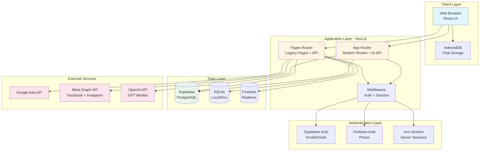

# SkalX AI System Architecture

This document provides a comprehensive overview of the SkalX AI platform architecture, including system design, component interactions, data flows, and architectural patterns.

---

## Table of Contents

1. [High-Level Architecture](#high-level-architecture)
2. [Detailed Component Architecture](#detailed-component-architecture)
3. [Authentication & Authorization Flow](#authentication--authorization-flow)
4. [Data Flow & Integration Pipeline](#data-flow--integration-pipeline)
5. [Project Structure](#project-structure)
6. [Key Architectural Patterns](#key-architectural-patterns)

---

## High-Level Architecture

### Architecture Overview

SkalX AI uses a **hybrid Next.js architecture** combining both the Pages Router (legacy, mature) and App Router (modern, cutting-edge):

- **Pages Router** (`/pages`): Handles all user-facing pages and the majority of API endpoints (46 routes)
- **App Router** (`/app`): Powers AI-driven endpoints and modern component architecture

This dual-router approach enables gradual migration while maintaining stability and leveraging new Next.js 13+ features for AI operations.

---

## Related Documentation

- [API Reference](./API_REFERENCE.md) - Complete API endpoint documentation
- [Database Schema](./DATABASE.md) - Database structure and relationships
- [Development Guide](./DEVELOPMENT.md) - Setup and development workflow
- [Meta Permissions](./META_PERMISSIONS_GUIDE.md) - Meta App Review guide

---

**Last Updated:** December 21, 2025
